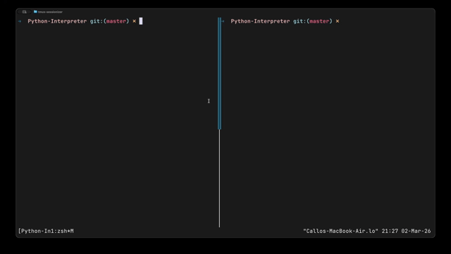

# Python Interpreter in C

A Python interpreter implementation written in C that supports core Python language features including functions, recursion, control flow, and Python's indentation-based syntax.

## Features

### Video Demo


### Supported Language Features
- Variables and assignment
- Arithmetic operations: `+`, `-`, `*`, `/`
- Comparison operations: `==`, `!=`, `<`, `>`, `<=`, `>=`
- Control flow: `if`/`else` statements, `while` loops
- Functions: definitions with `def`, calls with recursion support
- Built-in `print()` function
- Data types: numbers (integers and floats), strings
- String concatenation with `+`
- Python-style indentation with proper block handling
- Comments with `#`

### Architecture
- **Lexer**: Tokenizes Python source code with indentation handling via INDENT/DEDENT tokens
- **Parser**: Recursive descent parser building an Abstract Syntax Tree
- **Interpreter**: Tree-walking interpreter executing the AST directly
- **Symbol Tables**: Lexical scoping with hierarchical symbol table chains
- **Memory Management**: Comprehensive cleanup functions with AddressSanitizer testing
- **Recursion Safety**: Call depth limited to 200 to prevent stack overflow

## Project Structure

```
Python-compiler/
├── include/           # Header files
│   ├── ast.h         # AST node definitions and constructors
│   ├── interpreter.h # Interpreter state and evaluation
│   ├── lexer.h       # Lexer state and tokenization
│   ├── parser.h      # Parser state and parsing
│   ├── symbol_table.h# Symbol table and value types
│   ├── token.h       # Token type definitions
│   └── utils.h       # File I/O utilities
├── src/              # Source files
│   ├── ast.c         # AST implementation
│   ├── interpreter.c # Tree-walking interpreter
│   ├── lexer.c       # Lexical analyzer with indent handling
│   ├── main.c        # Main driver and built-in tests
│   ├── parser.c      # Recursive descent parser
│   ├── symbol_table.c# Symbol table implementation
│   └── utils.c       # File reading utilities
├── python_compiler.c # Unity build entry point
├── Makefile          # Build configuration
└── README.md         # This file
```

## Building

### Prerequisites
- GCC or Clang compiler
- Make utility
- Linux/Unix environment (POSIX.1-2008)

### Standard Build
```bash
make
```

This compiles the project as a unity build and creates the `python-compiler` executable.

### Debug Build with AddressSanitizer
```bash
make debug
```

Compiles with debug symbols and address sanitizer enabled for detecting memory errors.

### Clean Build
```bash
make clean
make
```

### Run Test Suite
```bash
make test
```

Executes all Python files in the `tests/` directory and reports pass/fail counts.

### Generate compile_commands.json for LSP
```bash
make compdb
```

Creates `compile_commands.json` for language server integration with editors like VS Code or Neovim.

## Usage

### Run Built-in Test Suite
Run the interpreter without arguments to execute the seven built-in tests:
```bash
./python-compiler
```

Expected output shows test results for arithmetic, conditionals, loops, functions, recursion, comments, and string operations.

### Execute a Python File
```bash
./python-compiler program.py
```

### Help
```bash
./python-compiler --help
```

## Example Programs

### Arithmetic
```python
x = 10
y = 20
result = x + y * 2
print(result)
```

### Conditionals
```python
age = 18
if age >= 18:
    print("Adult")
else:
    print("Minor")
```

### While Loops
```python
count = 0
while count < 5:
    print(count)
    count = count + 1
```

### Functions and Recursion
```python
def square(x):
    return x * x

def factorial(n):
    if n <= 1:
        return 1
    else:
        return n * factorial(n - 1)

print(square(5))       # Output: 25
print(factorial(5))    # Output: 120
```

### String Operations
```python
greeting = "Hello"
name = "World"
print(greeting + " " + name)  # Output: Hello World
```

## Implementation Details

### Lexical Analysis
The lexer handles Python's significant whitespace by maintaining an indent stack and generating INDENT/DEDENT tokens. Supports:
- Keywords: `if`, `else`, `while`, `def`, `return`, `print`
- Operators: `+`, `-`, `*`, `/`, `=`, `==`, `!=`, `<`, `>`, `<=`, `>=`
- Literals: numeric (integers and floats), string (with escape sequences)
- Identifiers: variable and function names
- Delimiters: `(`, `)`, `,`, `:`
- Comments: lines beginning with `#`
- Structural tokens: `NEWLINE`, `INDENT`, `DEDENT`

### Parsing
Recursive descent parser constructing an AST with proper operator precedence. Handles:
- Expression parsing with binary and unary operators
- Statement parsing: assignments, control flow, function definitions
- Block parsing with indentation-based scope delimiters
- Function parameters with validation (maximum 64 parameters)

### Interpretation
Tree-walking interpreter evaluating the AST with:
- Dynamic typing using tagged unions
- Hierarchical symbol tables for lexical scoping
- Function calls with local scope creation
- Call depth tracking to prevent stack overflow
- Return value propagation through the call stack

### Symbol Tables
Scope chain implementation:
- Global scope for module-level bindings
- Local scopes created for each function call
- Parent pointer chain for variable resolution
- Automatic memory management of string values

### Memory Management
- All heap allocations paired with cleanup functions
- Recursive freeing of AST nodes
- Symbol table destruction with value cleanup
- No memory leaks when tested with AddressSanitizer

## Limitations

### Not Implemented
- Lists, dictionaries, tuples, sets
- For loops and `range()`
- Classes and object-oriented features
- Import statements and modules
- Exception handling
- Generators and iterators
- List comprehensions
- Lambda functions
- Multiple assignment
- Boolean type (uses numeric truthiness)
- Additional built-in functions beyond `print()`

### Current Restrictions
- String operations limited to concatenation
- Function argument count must match parameter count exactly
- No default parameter values or keyword arguments
- No variable-length argument lists
- Integer division returns float result
- No bitwise or logical operators (`and`, `or`, `not`)

## Technical Notes

### Unity Build
The project uses a unity build approach where `python_compiler.c` includes all translation units. This provides:
- Faster compilation through single-pass processing
- Better opportunities for compiler optimization
- Simplified dependency management

Traditional separate compilation is also supported through the individual source files.

### Call Depth Limiting
Function calls are limited to 200 levels of recursion. This prevents stack overflow while providing sufficient depth for practical programs. The limit is enforced in the interpreter before creating new stack frames.

### Indentation Handling
The lexer maintains a stack of indentation levels measured in spaces (tabs count as 4 spaces). When indentation increases, an INDENT token is emitted. When it decreases, one or more DEDENT tokens are queued. Blank lines and comment-only lines are ignored for indentation purposes.

### Value Semantics
Runtime values are represented as tagged unions:
- `VALUE_NUMBER`: IEEE-754 double precision
- `VALUE_STRING`: heap-allocated C string (owned)
- `VALUE_FUNCTION`: borrowed pointer to AST function definition node
- `VALUE_NONE`: represents Python's `None` and void returns

## Development

### Adding Features
To extend the interpreter:
1. Add token types to `enum token_type` in `token.h`
2. Update lexer in `lexer.c` to recognize new syntax
3. Add AST node types to `enum ast_node_type` in `ast.h`
4. Extend parser in `parser.c` with new grammar rules
5. Implement evaluation in `interpreter.c`
6. Add memory cleanup in `ast_free()` if needed

### Testing
Add new test cases to the `tests[]` array in `main.c`. Each test includes a name and source code string. The built-in test runner executes all tests when the interpreter runs without arguments.

For external test files, create a `tests/` directory with `.py` files and run:
```bash
mkdir -p tests
# Add your .py test files to tests/
make test
```

The test target runs all Python files in `tests/` and reports how many passed or failed.

### Code Style
- C99 standard compliance
- POSIX.1-2008 for file I/O
- Comprehensive error messages with line numbers
- Defensive programming with NULL checks
- Consistent naming: `snake_case` for functions and variables
- Structured error handling via stderr

## License

Educational project demonstrating interpreter implementation and compiler construction techniques.
